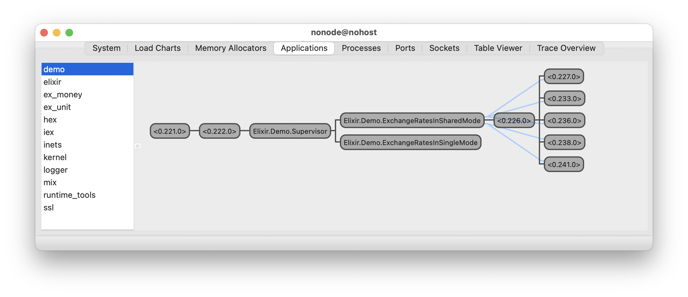

# Demo

A showcase for `Money.ExchangeRatesLite`.

## Quick start

```
$ export OPEN_EXCHANGE_RATES_APP_ID="your app id"
$ mix deps.get
$ iex -S mix
```

## `Demo.ExchangeRatesInSingleMode`

This is a demo for running `ExchangeRatesLite` in single mode.

Play with it:

```
iex> Demo.ExchangeRatesInSingleMode.last_updated()
iex> Demo.ExchangeRatesInSingleMode.latest_rates()
iex> Demo.ExchangeRatesInSingleMode.historic_rates(~D[2022-02-01])
```

## `Demo.ExchangeRatesInSharedMode`

This is a demo for running `ExchangeRatesLite` in shared mode. All the instances of `ExchangeRatesLite` are managed by a pool manager, which is supported by `:poolboy`.

Play with it:

```
iex> Demo.ExchangeRatesInSharedMode.last_updated()
iex> Demo.ExchangeRatesInSharedMode.latest_rates()
iex> Demo.ExchangeRatesInSharedMode.historic_rates(~D[2022-02-01])
```

> From the callers' perspective, there's no difference between `Demo.ExchangeRatesInSingleMode` and `Demo.ExchangeRatesInSharedMode`. It indicates that the abstraction of `Money.ExchangeRatesLite` is compact enough to meet various use cases.

## The graph of supervisor tree:


